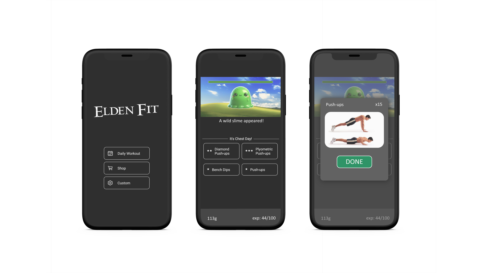

  

Elden Fit is a unique mobile fitness application designed to make workouts engaging by incorporating RPG elements. Track your fitness journey, level up, and embark on quests—all while getting fit! This project is a third-year school project developed by a single student.


[](https://youtu.be/3qFRCVwvi8Y)

## Table of Contents
- [Features](#features)
- [Screenshots](#screenshots)
- [Installation](#installation)
- [Usage](#usage)
- [Roadmap](#roadmap)
- [Contributing](#contributing)

## Features
- **Quests and Challenges**: Complete fitness challenges to gain experience points and level up.
- **Progress Tracking**: Monitor your workouts, set goals, and track your progress over time.
- **Rewards System**: Earn rewards and unlock new gear as you progress.
- **Interactive Maps**: Explore different in-game regions by completing real-life exercises.

## Screenshots


## Installation
To get started with Elden Fit, follow these steps:

1. **Clone the repository:**
    ```bash
    git clone https://github.com/frietvorkje69/elden-fit.git
    ```
2. **Navigate to the project directory:**
    ```bash
    cd elden-fit
    ```
3. **Install dependencies:**
    ```bash
    npm install
    ```
4. **Start the app:**
    ```bash
    npx expo start
    ```

## Usage
1. **Embark on quests**: Complete daily and custom fitness challenges.
2. **Earn rewards**: Level up and unlock new equipment and abilities.

## Roadmap
Future improvements and features planned for Elden Fit include:
- More diverse quests and challenges.
- Integration with wearable fitness devices.
- Add analytics and insights.
- Customization options for avatars.

## Contributing
Contributions are welcome! If you have suggestions for new features or improvements, please open an issue or submit a pull request. Follow these steps to contribute:

1. **Fork the repository**
2. **Create a new branch** (`git checkout -b feature/YourFeature`)
3. **Commit your changes** (`git commit -m 'Add some feature'`)
4. **Push to the branch** (`git push origin feature/YourFeature`)
5. **Open a pull request**

